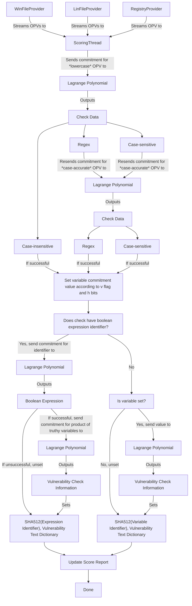

# Zeka: The Zero-Knowledge Argument Engine

Zeka is a .NET scoring engine for "find-and-fix" cybersecurity exercises, featuring a novel cryptographic scheme and event processing model that ensure competition integrity and ease of use for both the competitor and the organizer.

## Motivations
Jump to <a href="#motivation-1">1</a>, <a href="#motivation-2">2</a>, <a href="#motivation-3">3</a>, <a href="#motivation-4">4</a>, or the <a href="#flowchart">flowchart</a>.
 
1.  **How can we *represent* scoring data in such a way that an adversary "cannot" deduce them?**  
   - **Summary**: Zeka uses a specially defined curve as a "lookup table" of sorts that stores scoring data without making any distinctions between relevant and irrelevant information. Zeka by default requires that each piece of stored data be <ins>128</ins> bytes or fewer.
   - Zeka represents scoring data as a **Lagrange polynomial** $L(x)$ over a finite field $F$ of prime order $p$. This prime is also called the *field modulus*. This is useful because of four properties: 
	   1) A polynomial can be identified by its coefficients uniquely.
	   2) These coefficients are $\bmod$ $p$.
	   3) There exists a unique Lagrange polynomial that interpolates between the set of points $X$.
	   4) A polynomial is continuous everywhere. 

		Properties 1 and 2 allow scoring data to be represented relatively compactly as a list of $|X|$ integer coefficients $l_i$, where $l_i$ is guaranteed to be less than $p$. Properties 3 and 4 allow the Lagrange polynomial to serve as a "lookup table" that maps values $x$ to arbitrary information $y$ without inherently revealing whether $(x, y)$ belongs to $X$ or $X'$. Details about the nature of $y$ are described in <a href="#motivation-4">4</a>.
   - Since $X$ can be chosen arbitrarily, Zeka introduces random points into $X$ to ensure that the number of coefficients $l_i$ does not reveal the exact number of scoring checks. 
   - In Zeka, the default field modulus is $\frac{(98 \cdot  10^{161} - 89)}{99} = 98989 ... 98989$ (161 digits). Though this value is 134 bytes, Zeka requires 6 bytes of overhead for scoring metadata, as described in <a href="#motivation-4">4</a>, so each scoring datum within Zeka is allocated <ins>128</ins> bytes. It's possible to choose a larger field modulus --- it shouldn't have a noticeable impact on performance --- but it may be difficult to do so; see the <a href="#note-4">note in 4</a>. I chose this field modulus because it was funny, convenient, and probably large enough.
   -  **NOTE:** an ideal, computationally unbounded adversary can simply try all possibilities and learn the encoded data, thus the quotation marks. For all intents and purposes, we can assume that if such an adversary were to exist, it would not care about Zeka :)

2.  **How can we *interact with* scoring data in such a way that an adversary "cannot" deduce them?**  
   - **Summary**: Zeka uses a fast "one-way" function to deter an adversary with knowledge of Zeka's internal state from learning how to configure the system correctly.
   - Zeka draws upon the **discrete logarithm assumption** to hide information in its internal state. Specifically, Zeka uses **Pedersen commitments** $c_x$ for a piece of information $x$. The commitment is given by $c_x = g^x \mod p$, where $g$ is a multiplicative generator of $F$. 
**NOTE:** If you're already familiar with Pedersen commitments, you might notice that Zeka does not use a blinding factor $h^r$ when computing $c_x$. This is because scoring data must be constant upon image release, so I'm not sure if it's possible to compute useful blinding factors that actually contribute to the "hidingness" of the commitments in a way that can still be "looked up" in $L$. If you identify a solution to this problem, please <a href="#contact">propose it to me</a>.
   - Internally, Zeka will always operate on $L(c_x)$ rather than $L(x)$. This is to ensure that in the very unlikely scenario that an adversary somehow learned the commitment $a$ such that $(a, L(a)) \in X$, the adversary would not inherently learn how to configure the system in such a way that Zeka would internally compute $a$ and operate on $L(a)$. However, if the adversary knows $a$, they also know $L(a)$ since $L$ is public. Thus, they *may* still be able to brute force logical system configurations that satisfy the check data contained in $L(a)$.
   - Zeka commits to **operation-path-value** (OPV) data by multiplying the commitments for each operation-path-value datum. However, consider the paths `/abc/123` and `/123/abc`. Since multiplication is commutative, the commitments for these paths would be identical if `abc` and `123` were committed using the same generator $g$. To solve this problem, Zeka uses a seeded PRNG to produce generators $g_0, g_1, g_2, \dots$ whose discrete log relationships are unknown. Then, Zeka computes the commitment for the operation-path-value datum at index $i$ using $g_i$. In Zeka, the default seed is $1835364215$. This is an arbitrary value that does not *need* to be changed, but it *can* be for extra safety. 
   - Operation-path-value data is committed provider agnostically. For example:
	   - Uncommitted: `<SET>, C:, b.txt, hi` ≡ `1, 17210, 417391212660, 26729` → Committed: $g_0^{1} \cdot g_1^{17210} \cdot g_2^{417391212660} \cdot g_3^{26729}  \bmod \frac{(98 \cdot  10^{161} - 89)}{99}$.
	   - Uncommitted: `<SET>, C:, b.txt` ≡ `1, 17210, 417391212660` → Committed: $g_0^{1} \cdot g_1^{17210} \cdot g_2^{417391212660} \bmod \frac{(98 \cdot  10^{161} - 89)}{99}$. Notice that the operation-path-value data does not need to contain a value. This is necessary for file existence checks.
	   - Uncommitted: `<SET>, root, a.txt, hi` ≡ `1, 1919905652, 421686179956, 26729` → Committed: $g_0^{1} \cdot g_1^{1919905652} \cdot g_2^{421686179956} \cdot g_3^{26729} \bmod \frac{(98 \cdot  10^{161} - 89)}{99}$.
	   - Uncommitted: `<SET>, HKLM, ..., DisableCAD, 0` ≡ `1, 1212894285, ..., 323066142997480174993732, 48` → Committed: $g_0^{1} \cdot g_1^{1212894285} \cdot \dots \cdot g_8^{323066142997480174993732} \cdot g_9^{48} \bmod \frac{(98 \cdot  10^{161} - 89)}{99}$.
	   -  Uncommitted: `<DELETE>, C:, malware.exe` ≡ `2, 17210, 132232984737475438410299493` → Committed: $g_0^{2} \cdot g_1^{17210} \cdot g_2^{132232984737475438410299493} \bmod \frac{(98 \cdot  10^{161} - 89)}{99}$. 

	   **NOTE:** the `<DELETE>` operation is only for files, not strings. **In Zeka, it is NOT possible to check whether a file *does not* contain a string.**

3.  **How can we *gather information* about the system to be checked against the scoring data without revealing what we're checking?**  
   - **Summary**: Upon boot, Zeka catalogs the *entire* system. Then, Zeka begins listening for <ins>any</ins> changes to Registry keys or files and immediately processes or catalogs the emitted metadata, depending on the configured <a href="#processing-types">processing type</a>.
   - Zeka relies on three total providers: `RegistryProvider`, `WinFileProvider`, and `LinFileProvider`. There is no command output provider; **in Zeka, it is NOT possible to check the outputs of commands.** Upon boot, each provider streams *every* path and value that it manages to Zeka, which then calculates commitments and performs scoring checks on the incoming data. Then, each provider begins emitting events whenever a path it manages is created, modified, or deleted. Create and modify events are both emitted with the `<SET>` operation. For `RegistryProvider` and `WinFileProvider`, this is done through **Event Tracing for Windows** and NTFS' **Update Sequence Number journal**, respectively. For `LinFileProvider`, this is done through **eBPF**. 
   -  Zeka can process emitted metadata in two ways: 
	   1. <ins>Development mode</ins>. As soon as Zeka receives a new event from a provider, it performs scoring checks on the emitted metadata. The results of these checks are released immediately.
	   2. <ins>Competition mode</ins>. As soon as Zeka receives a new event from a provider, it stores the state of the OPV data --- or updates it if the emitted state has already been cataloged --- until the next scoring interval. When the next scoring interval begins, Zeka performs scoring checks on the cached OPV data and releases the results to the competitor. 

4.  **How can we *design scoring logic* such that it adheres to Zeka's hiding principles while still allowing the organizer to check complex states?**  
   - **Summary**: Zeka allows regex, case-insensitive, and case-sensitive match checks that can optionally be combined using logical AND and OR gates.
   - In this section, an output $y = L(c_x)$ such that $(c_{x}, y) \in X$ is referred to as *check data*. Zeka uses a unified structure for its check data:
     - General byte layout: `overhead (6 bytes), data (128 bytes)`.
     - Overhead bit layout: `00cccccc vhhhhhhh hhhhhhhh bbbbbbbb bbbbbbee eeeeeeee`.
       - `00`: <ins>null bits</ins>. Required. Ensures that all check data is less than the field modulus.
       - `c`: <ins>check type</ins>. Required. Specifies how Zeka should treat `data`.
       - `v`: <ins>variable setter flag</ins>. Required. Specifies whether the variable (<a href="#bit-b">b</a>) should be set or unset.
       -  `h`: <ins>hiding data</ins>. Required. Upon a successful check against `data` according to the check type, this value is added to each operation-path-value datum in $x_0$ to compute $x_{success}$. Then, Zeka computes $y_h = L(c_{x_{success}})$. If the boolean expression identifier (<a href="#bit-e">e</a>) is null, $y_h$ is guaranteed to be of type `vulnerability check information` (<a href="#checktype-1">4.a</a>). Otherwise, it is simply treated as an argument of knowledge of the uncommitted path (this is used in <a href="#bit-b">b</a>).
       -  `b`: <ins>variable identifier</ins>. Required. Upon a successful check, Zeka internally sets a variable with this identifier to $y_h$ if the `v` bit is set, or to `0` if not. By default, all unset variables are equal to `0`.
       -  `e`: <ins>boolean expression identifier</ins>. Optional. Specifies that this check is part of a logical combination of checks. To access the boolean expression, Zeka computes $y_e = L(c_{identifier})$, which is guaranteed to be of type `boolean expression` (<a href="#checktype-2">4.b</a>).

		 **NOTE:** If you change the field modulus, modify this bit layout to ensure that all check data is less than the field modulus.

   - Check types:
     1.  <ins>Vulnerability check information</ins>. A special type of "check" that simply contains the vulnerability check string and its associated point value. Example: `Forensics Question 1 Correct - 5pts`.
     2.  <ins>Boolean expression</ins>. Contains the boolean expression to test the internally-set variable identifiers with. If a variable is set to `0`, it is falsey, otherwise it is truthy. Example: `(1&2)|(1&3)`, where `1 = 12345`, `2 = 0`, and `3 = 67890` evaluates to true. Upon a successful check using relevant variable identifiers, all truthy variables are multiplied together, and Zeka computes $y_{success}=L(c_{product})$, which is guaranteed to be of type `vulnerability check information` (<a href="#checktype-1">4.a</a>).
     3.  <ins>Regex</ins>. Contains the .NET-flavored regex string to match the input against. Example: `^\s*ANSWER:\s*(?i)hello\s+(?-i)World!\s*$`. Upon a successful check, the process described in the <a href="#bit-h">h bits</a> section occurs.
     4.  <ins>Case-insensitive string match</ins>. Contains the string to match the input against, case-insensitively. Upon a successful check, the process described in the <a href="#bit-h">h bits</a> section occurs.
     5.  <ins>Case-sensitive string match</ins>. Contains the exact string to match the input against, case-sensitively. Upon a successful check, the process described in the <a href="#bit-h">h bits</a> section occurs.

# Flowchart

---
<a href="mailto:alex@ajiang.xyz">alex@ajiang.xyz</a>. Discord: @syossu.