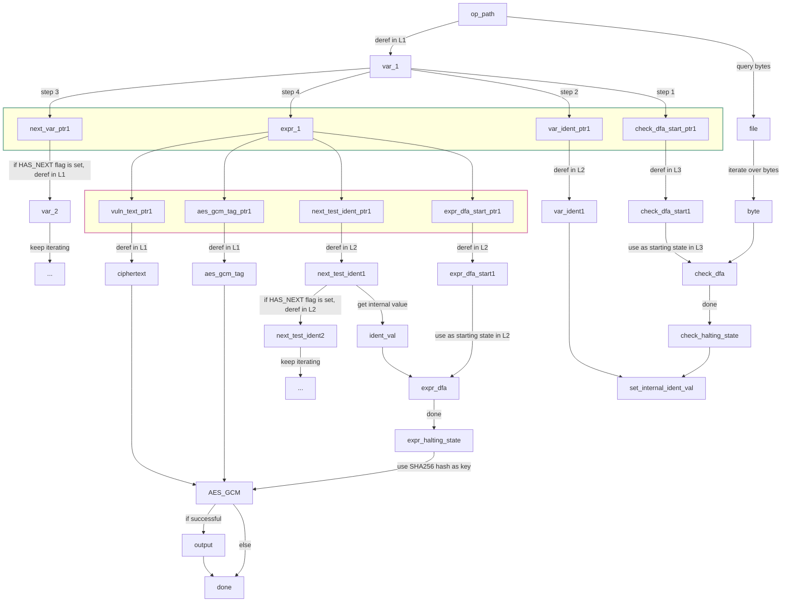

# Technical Documents

A non-comprehensive assortment of technical explanations and visualizations. More accessible readings may be uploaded here or elsewhere in the future (but don't count on them).

## Flowchart

