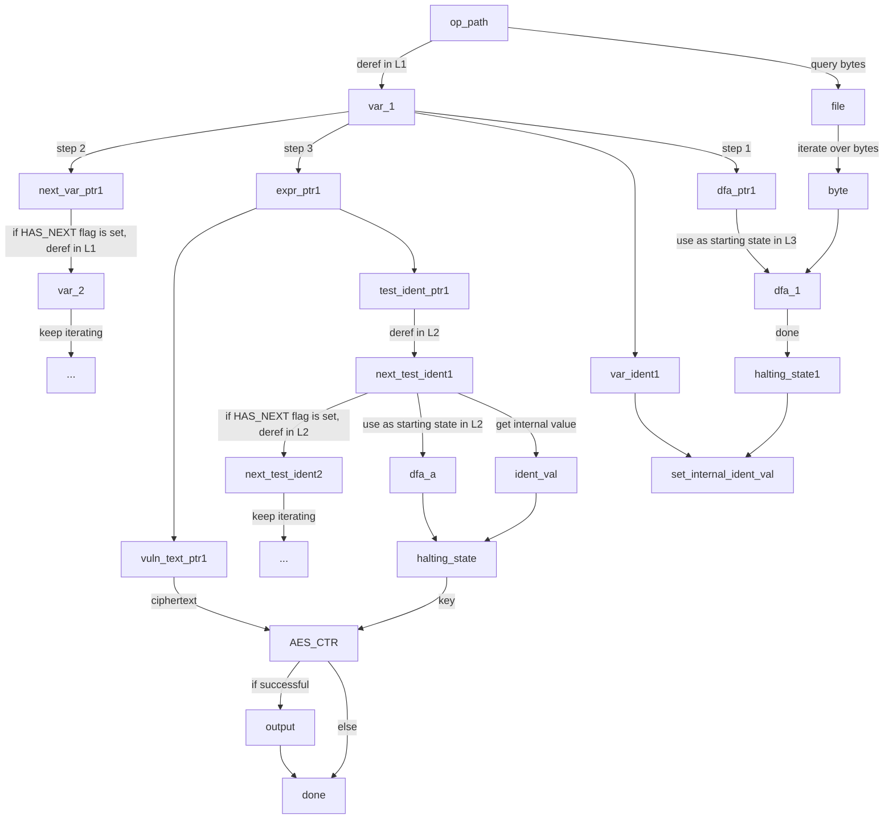

# Technical Documents

A non-comprehensive assortment of technical explanations and visualizations. More accessible readings are in the making.

## Flowchart

```mermaid
flowchart TD
    op_path -->|deref in L1| var_1
    var_1 -->|step 2| next_var_ptr1
    var_1 -->|step 3| expr_ptr1
    var_1 --> var_ident1
    var_1 -->|step 1| dfa_ptr1
    
    next_var_ptr1 -->|if HAS_NEXT flag is set, deref in L1| var_2
    var_2 -->|keep iterating| etc_1
    expr_ptr1 --> vuln_text_ptr1
    expr_ptr1 --> test_ident_ptr1
    test_ident_ptr1 -->|deref in L2| next_test_ident1
    var_ident1 --> set_internal_ident_val

    next_test_ident1 -->|if HAS_NEXT flag is set, deref in L2| next_test_ident2
    next_test_ident2 -->|keep iterating| etc_2


    next_test_ident1 -->|use as starting state in L2| dfa_a
    next_test_ident1 -->|get internal value| ident_val

    dfa_a --> halting_state
    ident_val --> halting_state

    vuln_text_ptr1 -->|ciphertext| AES_CTR
    halting_state -->|key| AES_CTR

    AES_CTR -->|if successful| output
    output --> done
    AES_CTR -->|else| done


    op_path -->|query bytes| file
    file -->|iterate over bytes| byte
    byte --> dfa_1
    dfa_ptr1 -->|use as starting state in L3| dfa_1
    dfa_1 -->|done| halting_state1

    halting_state1 --> set_internal_ident_val

    etc_1[...]
    etc_2[...]
```
